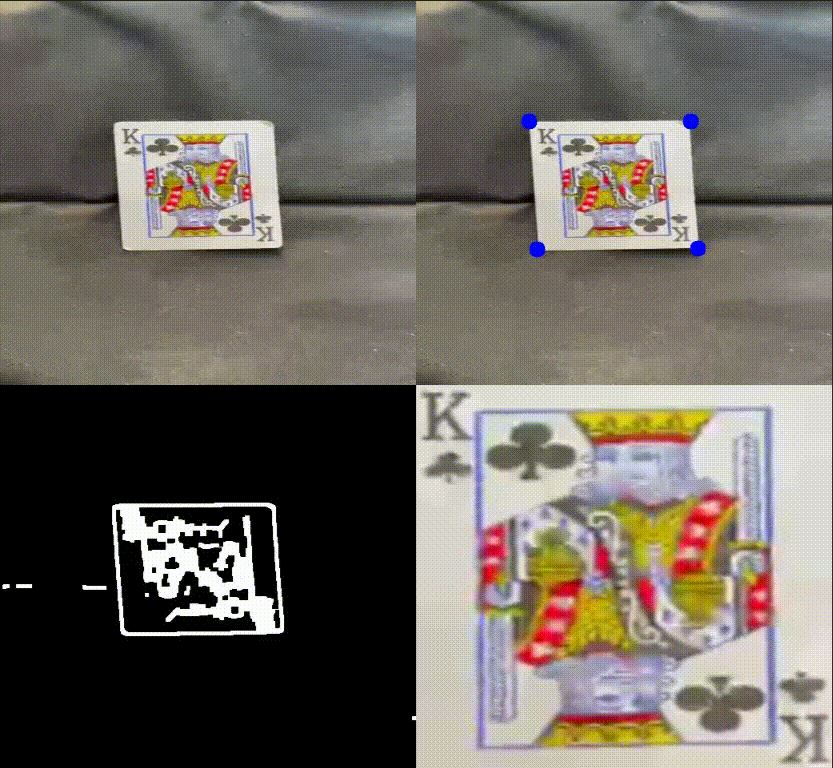

# 🖨️ Document Scanner using OpenCV

This project performs document detection and perspective transformation from a **video file** using **OpenCV**. It identifies the largest 4-point contour (usually a paper), applies a warp transformation, and displays a top-down "scanned" view.

---

## 📸 Demo



---

## 🧠 Features

- Real-time document detection from video
- Preprocessing pipeline (gray, blur, canny, dilation, erosion)
- Detects the largest quadrilateral contour
- Warps the document to a bird’s-eye view
- Shows all steps in a single stacked window

---

## 🛠 Technologies Used

- Python 3
- OpenCV
- NumPy

---

## ⚙️ How It Works

The script processes each frame from the video with these steps:

1. Convert to grayscale and blur the image
2. Apply Canny edge detection
3. Dilate and erode to strengthen edges
4. Find external contours
5. Detect the largest contour with 4 corners
6. Reorder the corners for correct perspective
7. Apply perspective transform using `cv2.getPerspectiveTransform`
8. Display original, contour-drawn, threshold, and warped views in one window

---

## ▶️ How to Run

1. Clone the repository or download the files.
2. Make sure Python is installed.
3. Install dependencies:

```bash
pip install opencv-python numpy
